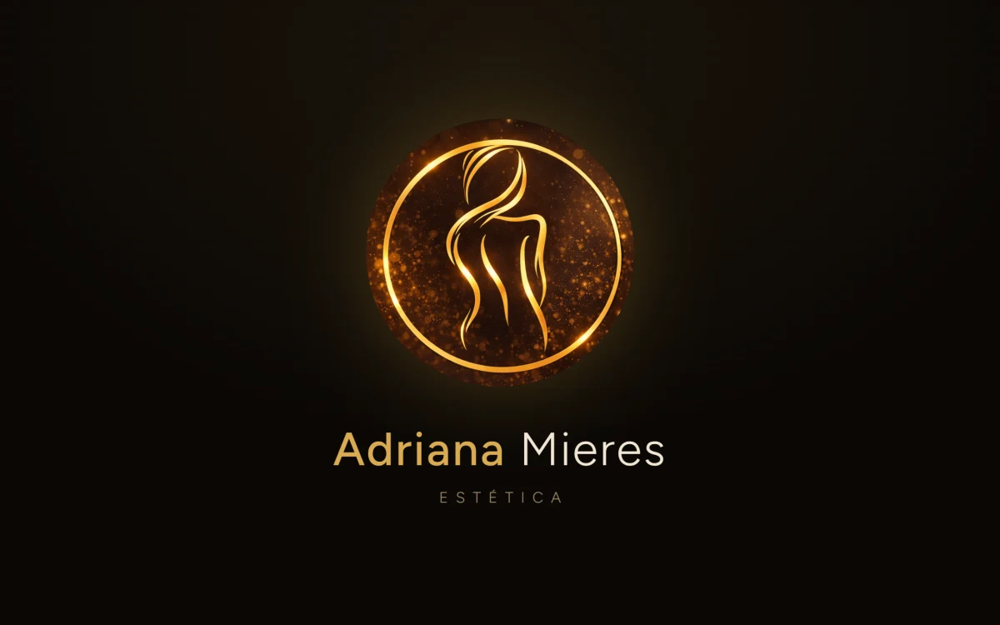
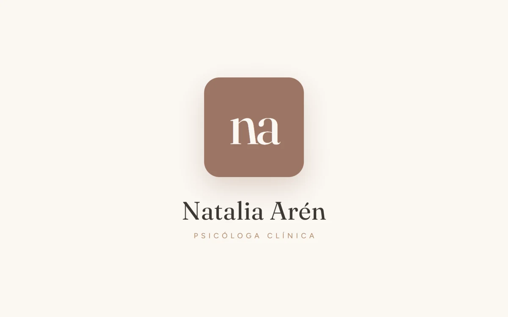
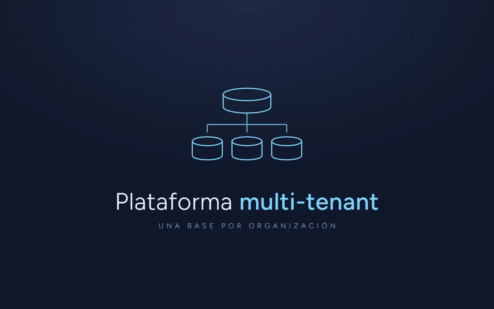
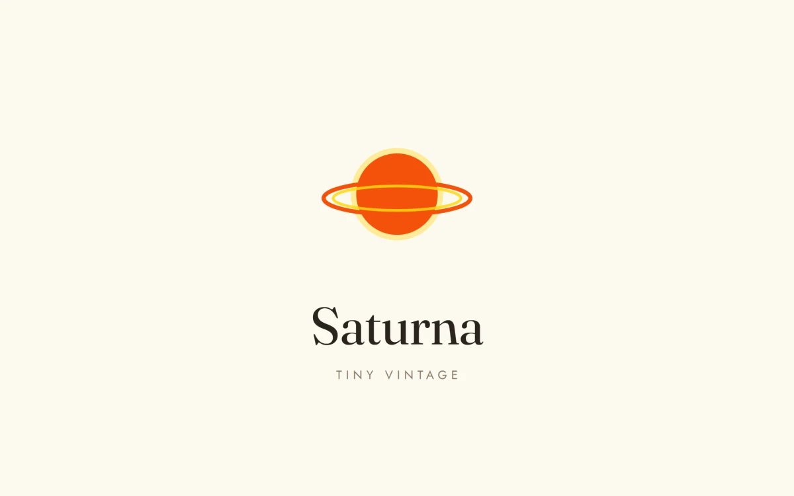
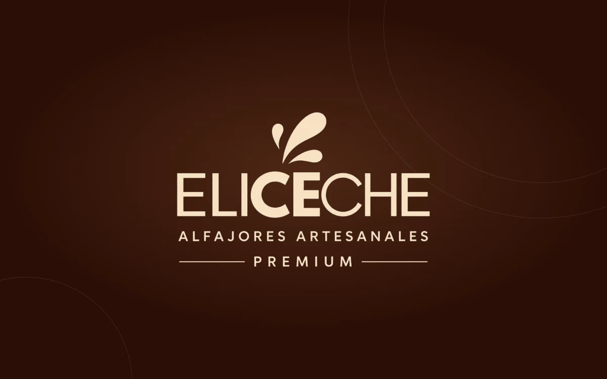

<!-- ══════════════════════ HEADER ══════════════════════ -->

  

  

  
  
  
  

 

<!-- ══════════════════════ SOBRE MÍ ══════════════════════ -->
## 👋 Sobre mí

Me metí en este mundo de chico, jugando con **"Inspeccionar elemento"**: ponía mi nombre en los títulos de las webs que usaba, cambiaba descripciones y hasta sacaba los anuncios que me distraían del juego de turno. Hasta que un día recargué la página… y todo desapareció 😅.

Ahí entendí que quería aprender a hacer que los cambios **se queden**. Hoy hago sistemas y webs para negocios de Uruguay que resuelven algo que se hace a mano. Primero el problema, después la tecnología. Lo ves andando, no en maqueta, y queda en tu dominio.

  
   
  🖥️ Donde trabajo

 

<!-- ══════════════════════ EN PRODUCCIÓN ══════════════════════ -->
## 🚀 En producción: seis trabajos reales

Cada uno resuelve un problema distinto. Los casos completos, con el problema, el modelo de datos y lo que cambió, están en <a href="https://lucashermida.com/#casos">lucashermida.com</a>.

<table>
  <tr>
    <td align="center" width="50%" valign="top">
      
        
      <strong>Adriana Mieres</strong> · Equipamiento de medicina estética
       
      
      
      
      
        
      Antes coordinaba cada pedido por WhatsApp. Ahora la tienda cobra sola.
        
      
      
    </td>
    <td align="center" width="50%" valign="top">
      
        
      <strong>Dra. Janet Guzmán</strong> · Consultorio médico-estético
       
      
      
      
      
        
      La historia clínica, los tratamientos, los cursos y los gastos del consultorio, en un solo lugar. Sistema privado.
        
      
    </td>
  </tr>
  <tr>
    <td align="center" width="50%" valign="top">
      
        
      <strong>Natalia Arén</strong> · Consultorio psicológico
       
      
      
      
        
      Los turnos se reservan desde la web, sin ida y vuelta para acordar la hora. Mi primer proyecto comercial.
        
      
      
    </td>
    <td align="center" width="50%" valign="top">
      
        
      <strong>Plataforma multi-organización</strong> · Arquitectura
       
      
      
      
        
      Varias organizaciones sobre un mismo sistema, cada una con sus datos aislados y su propia marca. Sistema privado.
        
      
    </td>
  </tr>
  <tr>
    <td align="center" width="50%" valign="top">
      
        
      <strong>Saturna · Tiny Vintage</strong> · Tienda de ropa vintage
       
      
      
      
        
      Un e-commerce vintage en construcción, con la landing ya publicada mientras se completa el catálogo online.
        
      
      
    </td>
    <td align="center" width="50%" valign="top">
      
        
      <strong>Eliceche</strong> · Alfajores artesanales
       
      
      
      
        
      La landing ya está en su dominio, con el pedido por WhatsApp a un toque, mientras se arma el catálogo online.
        
      
      
    </td>
  </tr>
</table>

 

<!-- ══════════════════════ CÓMO TRABAJO ══════════════════════ -->
## 🧭 Cómo trabajo

<table>
  <tr>
    <td width="33%" valign="top"><strong>1 · Primero el problema</strong> Qué se hace a mano hoy, cuánto tiempo lleva y qué se pierde en el camino. La tecnología viene después.</td>
    <td width="33%" valign="top"><strong>2 · Lo ves andando, no en maqueta</strong> Trabajás sobre el sistema real, funcionando, y se ajusta sobre eso.</td>
    <td width="33%" valign="top"><strong>3 · Queda tuyo</strong> Publicado en tu dominio, con tus datos adentro. Sigo cerca para lo que aparezca después.</td>
  </tr>
</table>

 

<!-- ══════════════════════ STACK ══════════════════════ -->
## 🧰 Con qué está hecho

  
   
  

| | |
|---|---|
| **Backend** | PHP · Laravel 12 · Livewire · Volt · MySQL · SQLite |
| **Frontend** | React · TypeScript · Alpine · Tailwind · Vite · Blade |
| **Móvil** | Kotlin · Jetpack Compose · Android nativo |
| **Automatización** | Node · Puppeteer · agentes de IA (Claude) con pipelines propios: scraping, verificación de datos, generación y publicación de sitios |
| **Calidad** | Pest · PHPUnit · ESLint · Git |
| **Infraestructura** | Linux · SSH · cron · despliegue propio · dominios y correo |
| **Integraciones** | MercadoPago · Stripe · webhooks · APIs REST · modelos de lenguaje |

 

<!-- ══════════════════════ CÓDIGO ABIERTO ══════════════════════ -->
## 🔓 Código abierto: demos y experimentos

<table>
  <tr>
    <td align="center" width="50%" valign="top">
      
        
      <strong>🎮 MundoPS, e-commerce</strong>
       
      
      
      
        
      
        Tienda de videojuegos hecha <strong>a mano, sin frameworks</strong>: catálogo, carrito, checkout con Stripe y panel admin. La construí desde cero para entender qué resuelven los frameworks por dentro.
      
        
      
      
      
    </td>
    <td align="center" width="50%" valign="top">
      
        
      <strong>⚡ Presencia Flash, landing</strong>
       
      
      
      
        
      
        Landing 100% self-hosted, sin CDNs, para mostrarle a un cliente cómo puede verse su negocio en la web. Carga rápida y clara.
      
        
      
      
    </td>
  </tr>
  <tr>
    <td align="center" width="50%" valign="top">
       
      <h3>🎙️ Asistente Financiero por Voz</h3>
      
      
      
        
      
        App Android a la que <strong>le hablás</strong> y mantiene tus saldos, vencimientos y gastos al día usando un modelo de lenguaje.
      
        
      
        
    </td>
    <td align="center" width="50%" valign="top">
       
      <h3>🥋 Tenant Platform</h3>
      
      
      
        
      
        Demo de sistema <strong>multi-tenant</strong> para federaciones de Taekwondo de Uruguay: una sola plataforma, múltiples organizaciones, cada una con sus datos aislados. La base de la plataforma multi-organización de arriba.
      
        
      
        
    </td>
  </tr>
</table>

 

<!-- ══════════════════════ CONTACTO ══════════════════════ -->
## 📬 ¿Hablamos?

  Contame qué hace tu negocio a mano hoy. Si tiene solución te digo cómo, y si no, también.
    
  
  
  

  

